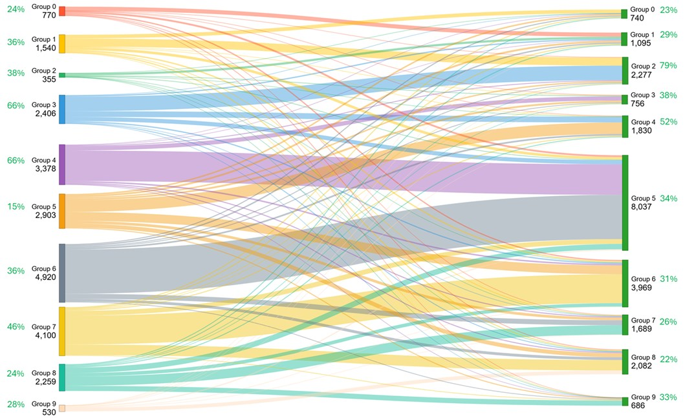
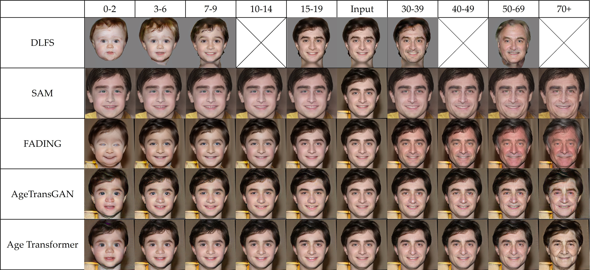

# AgeTransformer-VLM-based-Augmentation

AgeTransformer: A VLM-enhanced Model for Facial Age Transformation extends the original AgeTransgan architecture with vision-language guidance and mixture-of-experts (MoE) relabeling to generate ten age-conditioned renderings for every input face.

## Table of Contents
- [Highlights](#highlights)
- [Repository Layout](#repository-layout)
- [Prerequisites](#prerequisites)
- [Quick Start](#quick-start)
  - [AgeTransformer CLI](#agetransformer-cli)
  - [Streamlit Demo](#streamlit-demo)
  - [MoE Estimator CLI](#moe-estimator-cli)
  - [Training](#training-coming-soon)
- [Data and Checkpoints](#data-and-checkpoints)
- [MoE Age Estimator](#moe-age-estimator)
- [Performance](#performance)
- [Contributing](#contributing)
- [Citation](#citation)
- [Contact](#contact)

## Highlights
- Ten discrete age anchors learned by the AgeTransformer backbone.
- Vision-language guidance keeps identity stable while adjusting semantic age cues.
- MoE age estimator recalibrates FFHQ-Aging with ensemble-based uncertainty handling.
- CAF dataset receives DDColor restoration and ESRGAN super-resolution for sharper supervision.
- End-to-end recipes for inference demos and evaluation are included; full training release is planned.
- Ready-to-run AgeTransformer CLI (`agt_infer.py`), Streamlit demo (`app.py`), and MoE ensemble launcher (`moe_estimator.py`).

## Repository Layout
```
AgeTransformer-VLM-based-Augmentation/
|-- agt_infer.py            # CLI inference script (batched age translation)
|-- app.py                  # Streamlit demo UI
|-- models/                 # Place pretrained AgeTransformer + MoE checkpoints here
|-- module/                 # Core model, dataset, and loss implementations
|-- moe_age_estimator/      # MoE ensemble utilities (Janus-Pro, MiVOLO, ResNet50, VGG16)
|-- requirements.txt        # Python dependencies
```

## Prerequisites
- Python 3.10+
- CUDA-capable GPU (recommended) with matching PyTorch build
- Conda or venv for isolated environments

Install PyTorch that matches your CUDA driver from [pytorch.org](https://pytorch.org/get-started/locally/) before installing the remaining packages.

## Quick Start

### 1. Clone and Environment Setup
```bash
git clone https://github.com/coconutbee/AgeTransformer-VLM-based-Augmentation.git
cd AgeTransformer-VLM-based-Augmentation

conda create -n atf python=3.10
conda activate atf
pip install torch torchvision torchaudio --index-url https://download.pytorch.org/whl/cu121  # pick the right CUDA/CPU wheel
pip install -r requirements.txt
```

### AgeTransformer CLI
Download the required checkpoints (see [Data and Checkpoints](#data-and-checkpoints)) and place them under `models/`. Then run:
```bash
python agt_infer.py \
  --ckpt models/agetransformer.pt \
  --input path/to/face_or_directory \
  --out outputs/ \
  --targets 0 3 5 9
```
Key flags:
- `--size` must match the training resolution (default 128).
- `--targets` accepts any subset of the 10 anchor classes.
- `--device`, `--fp16`, and `--bf16` let you control acceleration.

### Streamlit Demo
For an interactive UI:
```bash
streamlit run app.py
```
Upload images, select target age IDs, and preview/download the generated grids directly from the browser.

### MoE Estimator CLI
`moe_estimator.py` batches Janus-Pro, MiVOLO, VGG16, and ResNet50 predictions, then fuses them with the dynamic MoE head to produce relabeled ages.
```bash
python moe_estimator.py
```
Before running, download and build the Janus-Pro 7B model (see [huggingface.co/deepseek-ai/Janus-Pro-7B](https://huggingface.co/deepseek-ai/Janus-Pro-7B)) and update `CONFIG['janus_model_path']` to point at the local checkpoint directory.
Defaults are controlled by the `CONFIG` dictionary near the top of the script:
- `image_folder`: root directory of input face crops (recurses into subfolders).
- `*_model_path`: local checkpoints for each expert; download links are listed below.
- The script expects the helper environments defined in the repo docs (`Janus`, `mivolo`, `IPCGAN`). Adjust the `conda run` commands if your setup differs.

Artifacts generated:
- `predictions_Janus.csv`: raw Janus outputs.
- `predictions.csv`: consolidated table containing expert scores and `MoE_Predicted_Age`.


## Data and Checkpoints
| Artifact | Description | Location / Link | Destination |
| --- | --- | --- | --- |
| MoE Age Estimator | Ensemble scripts + weights (Janus-Pro, MiVOLO, ResNet50, VGG16 fusion) | [mega](https://mega.nz/file/2U8lxRKJ#Z2KczVkP72AnvNawfK8tAGeNZknqrack3VGjbZZC6zM) | `models/age_estimator.pth` |
| CAF-Enhanced Dataset | DDColor + ESRGAN enhanced faces | [mega](https://mega.nz/folder/j1BWXa4T#DwHyfwBY9t84QxmS39ItIA) | `data/CAF_enhanced` |
| AgeTransformer Generator | Pretrained generator weights | [mega](https://mega.nz/file/XEk3HSTQ#X24EA0t0YlIJI8sIt6dN3iPHLu4rVagVfnI7q0uQ3iA) | `models/agetransformer.pt` |
| Expert Backbones | MiVOLO detector + checkpoint | [detector](https://drive.google.com/file/d/1CGNCkZQNj5WkP3rLpENWAOgrBQkUWRdw/view), [MiVOLO](https://drive.google.com/file/d/11i8pKctxz3wVkDBlWKvhYIh7kpVFXSZ4/view) | `models/` |
| Expert Backbones | ResNet50, VGG16, Janus-Pro | [ResNet50](https://mega.nz/file/eVty2bSY#byRidRMlh5G26mZ-23-Y9gXwxtKSFuRSx-7J43aVK24), [VGG16](https://mega.nz/file/HclwGZrR#qNEedMY5N2rBIui3CRTa59SNM9oMXvjt3Pr3_qMZix0), [Janus-Pro](https://huggingface.co/deepseek-ai/Janus-Pro-7B) | `models/` |

Example `models/` directory after downloading:
```
models/
├── 79999_iter.pth
├── age_estimator.pth
├── agetransformer.pt
├── best_dynamic_moe_model.pth
├── model_best_loss
├── model_imdb_cross_person_4.22_99.46.pth.tar
└── yolov8x_person_face.pt
```

## MoE Age Estimator
- Experts: Janus-Pro, MiVOLO, ResNet50, and VGG16 (legacy models).
- Gating network produces logits `g_i`; mixture weights use `w_i = softmax(g_i)`.
- Final age prediction aggregates expert outputs: `age = sum_i(w_i * age_i)`.
- `moe_age_estimator/` contains ensemble inference code and utilities for dynamic expert fusion.

## Performance

### (a) FFHQ-Aging

| Age group | 0-2 | 3-6 | 7-9 | 10-14 | 15-19 | 30-39 | 40-49 | 50-69 | 70+ |
| --- | --- | --- | --- | --- | --- | --- | --- | --- | --- |
| **DLFS** [[1]](#ref-dlfs) | 15.3 / 2.0 | 23.0 / <span style="color:blue">4.6</span> | 61.2 / 11.3 | – / – | 99.0 / 22.6 | 97.6 / 32.3 | – / – | 48.7 / 56.8 | – / – |
| **SAM** [[2]](#ref-sam) | 69.9 / 7.9 | 62.9 / 10.2 | 59.9 / 11.9 | 63.2 / 15.7 | 65.9 / 20.5 | 70.2 / 27.5 | 72.3 / 37.2 | 67.7 / 52.0 | 53.7 / 64.4 |
| **FADING** [[3]](#ref-fading) | 46.2 / 2.9 | <span style="color:blue">91.8</span> / 5.9 | 95.9 / <span style="color:blue">8.4</span> | 97.2 / 10.6 | <span style="color:blue">98.6</span> / 20.2 | <span style="color:blue">98.6</span> / 37.1 | <span style="color:blue">98.3</span> / 53.3 | <span style="color:blue">97.8</span> / 65.9 | <span style="color:blue">96.1</span> / 72.6 |
| **AgeTransGAN** [[4]](#ref-agetransgan) | 66.6 / **1.9** | 91.1 / **5.7** | <span style="color:blue">96.4</span> / 9.2 | <span style="color:blue">97.4</span> / <span style="color:blue">12.8</span> | 94.7 / <span style="color:blue">17.7</span> | 96.0 / <span style="color:blue">33.8</span> | 94.8 / **44.4** | 96.1 / **59.8** | 83.9 / <span style="color:blue">80.7</span> |
| **AgeTransformer (ours)** | **83.3** / <span style="color:blue">1.8</span> | **99.1** / **4.5** | **99.4** / **8.3** | **99.9** / **12.7** | **99.9** / **17.6** | **99.9** / **34.6** | **99.9** / <span style="color:blue">45.8</span> | **99.4** / <span style="color:blue">62.5</span> | **98.2** / **81.5** |

Verification rate (%) / EAM per age bucket. **Bold** = best, <span style="color:blue">blue</span> = second-best.

### (b) CAF

| Age group | 0-2 | 3-6 | 7-9 | 10-14 | 15-19 | 30-39 | 40-49 | 50-69 | 70+ |
| --- | --- | --- | --- | --- | --- | --- | --- | --- | --- |
| **DLFS** [[1]](#ref-dlfs) | 16.2 / 2.7 | 34.7 / 5.2 | 66.9 / 11.0 | – / – | 98.2 / 22.7 | 95.9 / 30.8 | – / – | 62.5 / 55.5 | – / – |
| **SAM** [[2]](#ref-sam) | **84.8** / 8.0 | 74.7 / 10.1 | 71.4 / 12.7 | 74.4 / 15.8 | 78.2 / 20.3 | 96.1 / 26.9 | 88.1 / 36.2 | 85.0 / 51.6 | 70.9 / 62.7 |
| **FADING** [[3]](#ref-fading) | 16.2 / <span style="color:blue">1.7</span> | <span style="color:blue">79.2</span> / 5.3 | <span style="color:blue">92.1</span> / <span style="color:blue">8.9</span> | <span style="color:blue">95.1</span> / 10.2 | <span style="color:blue">99.0</span> / 19.7 | <span style="color:blue">99.2</span> / <span style="color:blue">35.3</span> | <span style="color:blue">97.0</span> / 50.6 | <span style="color:blue">92.6</span> / <span style="color:blue">63.7</span> | <span style="color:blue">91.3</span> / 70.7 |
| **AgeTransGAN** [[4]](#ref-agetransgan) | 35.1 / 2.1 | 75.0 / <span style="color:blue">5.2</span> | 88.9 / 9.4 | 88.7 / <span style="color:blue">14.4</span> | 78.9 / <span style="color:blue">18.8</span> | 91.1 / 33.5 | 88.2 / <span style="color:blue">46.3</span> | 86.9 / <span style="color:blue">63.7</span> | 55.2 / <span style="color:blue">78.5</span> |
| **AgeTransformer (ours)** | <span style="color:blue">83.6</span> / **1.6** | **87.6** / **5.1** | **98.8** / **8.7** | **99.6** / **12.4** | **99.8** / **17.2** | **99.8** / **35.1** | **98.8** / **45.2** | **97.2** / **60.1** | **97.6** / **81.8** |

Verification rate (%) / EAM per age bucket. **Bold** = best, <span style="color:blue">blue</span> = second-best.

<a id="ref-dlfs"></a>**[1]** He et al., "Disentangled Lifespan Face Synthesis", CVPR 2021.  
<a id="ref-sam"></a>**[2]** Alaluf et al., "Only a Matter of Style", ACM 2021.  
<a id="ref-fading"></a>**[3]** Chen et al., "Face Aging via Diffusion-based Editing", Arxiv 2023.  
<a id="ref-agetransgan"></a>**[4]** Hsu et al., "AgeTransGAN", ECCV 2022.

## Visual Comparisons

### Relabeling Impact


The MoE pipeline corrects noisy age annotations. The left panel shows original labels, while the right panel reflects consolidated predictions after Janus-Pro, MiVOLO, VGG16, and ResNet50 fusion.

### Age Transformation Quality


Sample outputs from the pretrained generator illustrating ten discrete age anchors per identity. Rows correspond to input faces; columns show generated images ranging from youngest to oldest.

## Contributing
We welcome bug reports, feature suggestions, and pull requests once the public release is live. For large changes, open an issue first so we can align on the roadmap.

## Citation
If you leverage AgeTransformer-VLM-based-Augmentation or its datasets, please cite:
```
@misc{AgeTransformer2025,
  title  = {AgeTransformer: A VLM-enhanced Model for Facial Age Transformation},
  author = {Paul, ???},
  year   = {2025},
  note   = {Technical Report},
  url    = {https://github.com/USERNAME/AgeTransformer-VLM-based-Augmentation}
}
```

## Contact
- Email: <your_email@example.com>
- Issues: use the GitHub issue tracker once the repository is public.
- Release notes and announcements will be posted on the project page.
